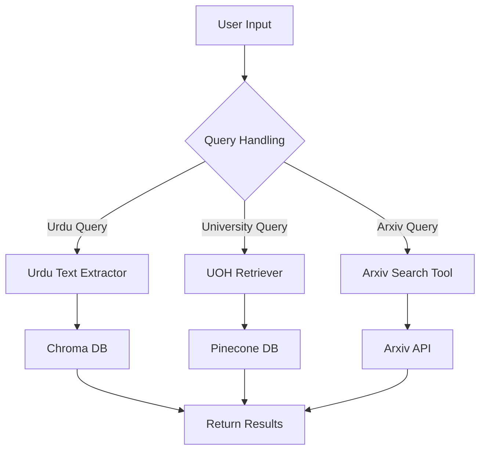

# Agent AI to Extract Urdu Text and Query University Data

## Introduction
This project leverages the power of multiple language models and vector databases to build an AI system capable of extracting Urdu text from online sources and retrieving information from the University of Haripur's website. The project uses Groq's LLaMA3, HuggingFace embeddings, Pinecone for vector storage, and Chroma for Urdu text. The chatbot intelligently selects the best tool based on the query.

## Features
- **Urdu Text Extraction:** Uses FacebookAI's XLM-RoBERTa for extracting and embedding Urdu text from BBC Urdu.
- **University Information Retrieval:** Extracts information from the University of Haripur's website.
- **Arxiv Research Paper Querying:** Integrates with Arxiv to search for academic papers.
- **Intelligent Query Handling:** Uses a language model to determine the best tool to use for each query.

## Tech Stack
- **Language Models:** Groq's LLaMA3, FacebookAI's XLM-RoBERTa
- **Vector Stores:** Pinecone, Chroma
- **Data Loaders:** WebBaseLoader, RecursiveUrlLoader
- **Text Splitters:** RecursiveCharacterTextSplitter
- **Frameworks and Libraries:** LangChain


## Installation
Make sure to install all the required libraries:
```bash
pip install langchain_community langchain langchain_core groq langchain-groq chromadb Arxiv langchain-pinecone pinecone-notebooks
```

## Usage
1. Clone the repository:
   ```bash
   git clone https://github.com/Arsalan-Azhar-AI/Langchain-Projects.git
   cd Agents
   ```
2. Set up environment variables for API keys:
   ```bash
   export GROQ_API_KEY="your_api_key"
   export HUGGING_FACE_KEY="your_api_key"
   export PINECONE_API_KEY="your_api_key"
   ```

## Architecture
The system architecture consists of three main components:
1. **Text Extraction and Embedding:** Extracts textual content from online sources and encodes it into vector representations.
2. **Vector Storage:** Stores vectors using Pinecone and Chroma for fast retrieval.
3. **Query Handling:** Uses a language model to select the appropriate tool for each query.

### Workflow Diagram


## How It Works
1. User inputs a query.
2. The system identifies the type of query (Urdu, UOH, Arxiv).
3. The corresponding tool is activated:


## Acknowledgments
Special thanks to Groq, HuggingFace, and Pinecone for their APIs and frameworks.
